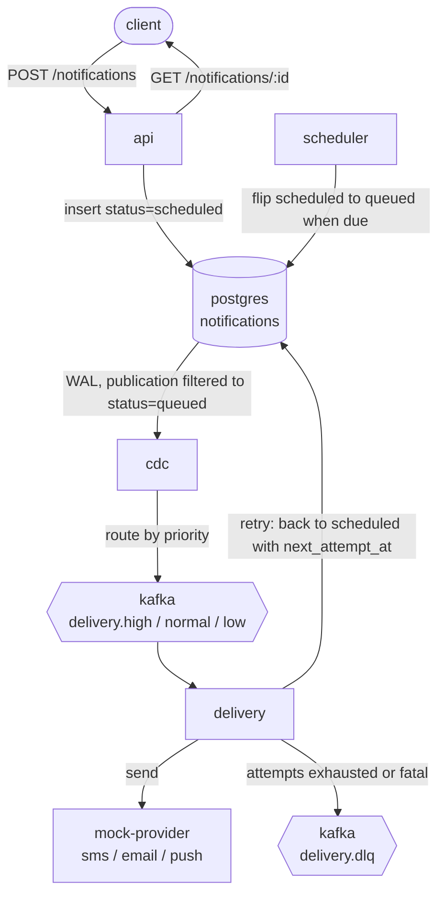

# Notification System

Event-driven notification platform in Go.

[](https://github.com/huseyinakuzum/notification-system/actions/workflows/ci.yml)
[](go.mod)
[](docker-compose.yml)
[](docker-compose.yml)
[](#observability-uis)

A notification's whole lifecycle (create, schedule, queue, deliver, retry,
dead-letter) lives on one Postgres table. Change data capture streams queued
rows into Kafka, and delivery workers drain them per priority lane. One table
owns the state, the `scheduled` to `queued` flip is the only thing that triggers
delivery, and each service is a small loop over that table or the topics it
feeds. No outbox.

## Contents

- [Architecture](#architecture)
- [How it maps to the requirements](#how-it-maps-to-the-requirements)
    - [1. Notification management API](#1-notification-management-api)
    - [2. Processing engine](#2-processing-engine)
    - [3. Delivery and retry](#3-delivery-and-retry)
    - [4. Observability](#4-observability)
    - [External provider](#external-provider)
    - [Bonus items](#bonus-items)
- [Quick start](#quick-start)
- [API](#api)
- [Poking at the API](#poking-at-the-api)
- [Observability UIs](#observability-uis)
- [Load testing](#load-testing)
- [Testing](#testing)
- [CI](#ci)
- [Configuration](#configuration)

## Architecture



### Components

| Service         | Responsibility                                                                                                                                         |
|-----------------|-------------------------------------------------------------------------------------------------------------------------------------------------------|
| `api`           | REST ingest and read API (chi). Validates, enforces idempotency, writes rows.                                                                          |
| `scheduler`     | Claims rows whose gate (`next_attempt_at` or `scheduled_at`) has passed and flips `scheduled` to `queued`. Same loop handles first sends and retries.  |
| `cdc`           | Reads the Postgres WAL through a row-filtered publication (`status='queued'`) and produces to the priority topics.                                      |
| `delivery`      | Drains the priority lanes with anti-starvation, per-channel rate limiting, backoff with jitter, and a DLQ when attempts run out. Attempt state in the DB. |
| `mock-provider` | Stands in for the downstream sms/email/push provider for local runs. Speaks the same contract as webhook.site.                                         |

### Data model

One `notifications` table carries the lifecycle (`scheduled`, `queued`,
`processing`, `sent`, `failed`, `cancelled`) plus delivery bookkeeping:
`attempts`, `next_attempt_at`, `last_error`, `provider_message_id`, `sent_at`. A
`templates` table holds reusable channel bodies. The publication is row-filtered
to `status='queued'` with `REPLICA IDENTITY FULL`, so only deliverable work
reaches Kafka and the `scheduled` to `queued` flip is the single event that
starts delivery.

## How it maps to the requirements

### 1. Notification management API

- **Create, single or batch.** `POST /notifications` takes a JSON array. One item
  or up to 1000 per request; over that is rejected (`MaxBatchSize` in
  `internal/api/validate.go`). The response returns a `batch_id` and the per-item
  `ids`.
- **Query by ID.** `GET /notifications/{id}` returns the row and its delivery
  state (attempts, last error, provider message id, sent-at). A scheduled row
  with no attempts yet has no delivery block.
- **Query by batch.** `GET /notifications/batch/{id}` returns the items and a
  per-status count map (e.g. 800 sent, 150 queued, 50 failed).
- **Cancel pending.** `DELETE /notifications/{id}` cancels a row that is still
  `scheduled`. Anything already past that returns `409`.
- **List with filters and pagination.** `GET /notifications` filters by `status`,
  `channel`, and a `from`/`to` time range (RFC3339), with `limit` (1-200, default
  50) and `offset`.

Full surface is in the [API](#api) table and in Swagger at `/swagger/`.

### 2. Processing engine

- **Async workers.** The API does not send. It writes a row and returns. The
  scheduler flips due rows, CDC streams them to Kafka, and delivery workers drain
  the topics. The worker pool scales separately from the request path.
- **Rate limiting, 100/s per channel.** Each channel has its own token-bucket
  limiter (`golang.org/x/time/rate`), default rate 100/s with a matching burst
  (`RATE_LIMIT_PER_CHANNEL`, `DELIVERY_RATE_BURST`). The buckets are independent,
  so one busy channel does not throttle the rest.
- **Priority queues.** Three Kafka topics: `delivery.high`, `delivery.normal`,
  `delivery.low`. CDC routes by the row's priority. The delivery picker prefers
  high but reserves capacity for the lower lanes so they still drain under load.
- **Content validation.** Required fields and per-channel length caps are checked
  at ingest (`internal/api/validate.go`): SMS 160, push 256, email 10000 chars.
  Channel and priority must be known values; empty priority defaults to `normal`.
  A bad item rejects the whole batch before any write.
- **Idempotency.** The server hashes `recipient + channel + content + priority +
  scheduled_at` (sha256, NUL-separated) into a key stored under a `UNIQUE`
  constraint. An identical payload collapses onto the existing row and is not
  sent again. Dedup is permanent, not windowed: change any field for a new key.
  The tradeoff is that a byte-identical notification cannot be sent twice.

### 3. Delivery and retry

- **Provider call.** Delivery POSTs `{to, channel, content}` and expects `202`
  with `{messageId, status, timestamp}`. The target is `PROVIDER_BASE_URL` +
  `PROVIDER_UUID` (defaults to webhook.site; see
  [external provider](#external-provider)).
- **Outcome classification.** `202` is sent. `429` and `5xx`/transport errors are
  retryable. Other `4xx` is fatal. Outcome and channel land on the metric.
- **Backoff with jitter.** A retryable failure re-schedules the row: status back
  to `scheduled` with a future `next_attempt_at` (exponential backoff plus
  jitter). The scheduler picks it up when the gate passes. Attempt count is on
  the row, so retries survive a worker restart.
- **Dead-letter.** When attempts reach `max_attempts`, or the outcome is fatal,
  the row goes to `delivery.dlq` and lands in `failed`.

### 4. Observability

- **Metrics.** Prometheus, namespace `nsys`:
    - `nsys_api_http_requests_total`, `nsys_api_http_request_duration_seconds` (histogram, for p50/p95/p99)
    - `nsys_scheduler_flipped_total` (scheduled to queued rate), `nsys_scheduler_poll_errors_total`
    - `nsys_delivery_attempts_total{outcome,channel,priority}` (sent/retry/fatal, sliced by channel and lane)
    - `nsys_delivery_duration_seconds{channel}` (delivery latency histogram)
    - `nsys_delivery_dlq_produced_total{channel}`
    - `nsys_cdc_events_total{op}`
    - `nsys_kafka_reader_*{topic}` — live consumer-group telemetry pulled from the
      kafka-go readers every 5s: `lag`, `offset`, `queue_length`, `queue_capacity`
      (gauges) and `messages_total`, `fetches_total`, `errors_total`,
      `rebalances_total`, `timeouts_total` (counters), one series per priority topic.
- **Structured logging with correlation IDs.** `log/slog` throughout. The API
  middleware reads or mints an `X-Correlation-ID`, echoes it on the response, and
  logs it as `correlation_id` so one request is traceable across services.
- **Health checks.** Each service exposes `/healthz` (liveness) and `/readyz`
  (readiness; api, scheduler, delivery ping the DB) on `:9090`.

### External provider

The brief asks for webhook.site as the provider. That is the default target
(`PROVIDER_BASE_URL=https://webhook.site/`, `PROVIDER_UUID=<your-uuid>`), and the
contract matches: `POST {to, channel, content}` returns
`202 {messageId, status, timestamp}`.

For an offline one-command run, the stack ships a `mock-provider` service with
the same contract, so `make up` works without reaching out to webhook.site. Set
`PROVIDER_UUID` to a real webhook.site bucket to watch the calls arrive.

### Bonus items

| Bonus                                | Status                                                                            |
|--------------------------------------|-----------------------------------------------------------------------------------|
| Failure handling (retry/backoff/DLQ) | Done. See [delivery and retry](#3-delivery-and-retry).                             |
| Scheduled notifications              | Done. `scheduled_at` (RFC3339) defers a send; the scheduler gates on it.           |
| Template system                      | Done. `POST /templates`, `GET /templates/{name}`; create can reference one by id.  |
| Distributed tracing                  | Done. OpenTelemetry over OTLP/gRPC to a collector that forwards to Jaeger.         |
| CI/CD pipeline                       | Done. GitHub Actions, see [CI](#ci).                                               |
| WebSocket real-time updates          | Not done. Status is read by polling the API.                                       |

## Quick start

Needs `podman` and `podman compose`. No Docker-specific features are used, so
`docker compose` works too.

```bash
make up        # build images and start the stack
make migrate   # apply database migrations
make topics    # create Kafka topics (auto-create is off)
```

Post a notification:

```bash
curl -sS -X POST localhost:8080/notifications \
  -H 'Content-Type: application/json' \
  -d '[{"recipient":"me@example.com","channel":"email","content":"hello","priority":"high"}]'
```

Read it back:

```bash
curl -sS localhost:8080/notifications/<id>
```

There are ready-made request files under [`requests/`](requests/); see
[poking at the API](#poking-at-the-api).

Tear down (drops volumes):

```bash
make down
```

## API

| Method | Path                        | Purpose                                                                                          |
|--------|-----------------------------|-------------------------------------------------------------------------------------------------|
| POST   | `/notifications`            | Create one or many (batch, up to 1000).                                                          |
| GET    | `/notifications`            | List with filters (`status`, `channel`, `from`, `to`) and pagination (`limit` 1-200, `offset`). |
| GET    | `/notifications/{id}`       | Fetch one with its delivery state.                                                               |
| GET    | `/notifications/batch/{id}` | Fetch a batch with per-status counts.                                                            |
| DELETE | `/notifications/{id}`       | Cancel a still-scheduled notification (409 if already in flight).                                |
| POST   | `/templates`                | Create a template.                                                                               |
| GET    | `/templates/{name}`         | Fetch a template.                                                                                |
| GET    | `/swagger/*`                | OpenAPI UI.                                                                                       |

Channels: `sms`, `email`, `push`. Priorities: `high`, `normal`, `low`.

## Poking at the API

`requests/` holds `.http` files (VS Code REST Client / IntelliJ HTTP client
format) so you can fire requests without writing curl by hand:

| File                          | What it covers                                                          |
|-------------------------------|------------------------------------------------------------------------|
| `requests/notifications.http` | Single create, get by id, list, list with filters, cancel.             |
| `requests/batch.http`         | Batch creates: small batch, mixed channels/priorities, a validation rejection, batch lookup. |
| `requests/scheduled.http`     | Deferred sends via `scheduled_at`.                                      |
| `requests/templates.http`     | Create a template and send through it.                                  |

`scripts/send.sh` does the same from the shell. `scripts/send.sh 1000` posts a
1000-item batch and prints the response (`scripts/send.sh 50 sms high` for 50
sms at high priority).

## Observability UIs

Everything you need to watch the pipeline end to end is bundled in the stack and
wired up on first boot — no manual datasource or dashboard setup.

| Tool       | URL                    | Notes                                                                     |
|------------|------------------------|---------------------------------------------------------------------------|
| Grafana    | http://localhost:3000  | Anonymous admin; the "Notification System" dashboard is auto-provisioned. |
| Prometheus | http://localhost:9091  | Scrapes all four services every 5s. Host 9091 maps to container 9090.     |
| Jaeger     | http://localhost:16686 | Distributed traces, api -> cdc -> delivery -> provider.                   |
| Kafka UI   | http://localhost:8090  | Topic, partition, and consumer-group inspection.                          |
| Swagger    | http://localhost:8080/swagger/ | OpenAPI UI for the notification and template endpoints.           |

### The Grafana dashboard

The provisioned **Notification System** dashboard (`http://localhost:3000`) is
the single pane of glass. It opens on the last 30 minutes, auto-refreshes every
10s, and is organised into six rows so you can read the system top to bottom:

- **Overview** — at-a-glance stat tiles: delivery success %, delivered/s, API
  requests/s, API p95 latency, total Kafka lag, DLQ/s. Color thresholds flip the
  tiles red when something is wrong.
- **Throughput** — API requests by status, delivery attempts by outcome
  (stacked sent/retry/fatal), CDC events by op.
- **Latency** — API latency quantiles (p50/p95/p99) and a latency heatmap,
  plus delivery latency by channel (p95/p99).
- **Kafka pipeline** — consumer lag by topic, fetch queue depth vs capacity,
  messages consumed/s, reader errors/timeouts/rebalances, and committed offset
  per lane. This row is driven by the `nsys_kafka_reader_*` series.
- **CDC & scheduler** — scheduler flips/s, scheduler poll errors/s, cumulative
  CDC events by op.
- **Errors & DLQ** — delivery retry vs fatal/s and DLQ produced/s by channel.

Drive load through the system (see [load testing](#load-testing)) and every row
lights up in real time.

Tracing exporter is selectable with `OTEL_EXPORTER` (`otlp`, `stdout`, `noop`).

## Load testing

Two ways to put traffic through the pipeline.

**One-shot batches** — `scripts/send.sh` posts a batch and prints the response:

```bash
scripts/send.sh 1000           # 1000-item batch
scripts/send.sh 50 sms high    # 50 sms at high priority
```

**Continuous randomized load** — `scripts/loadtest.sh` forks N worker loops that
post (forever, or for a fixed duration), randomizing every dimension so all
lanes, channels, and the scheduler path stay exercised:

- random channel and priority (drawn from configurable sets),
- a configurable single/batch split, with batch size in a configurable range,
- a configurable fraction scheduled 3-12s into the future, so the
  `scheduled -> queued` flip (and therefore CDC) is driven, not just immediate sends.

Everything is a flag (with an env fallback); `-h` prints the full list:

```bash
scripts/loadtest.sh                  # 1 worker, ~0.2-0.7s pace, until Ctrl-C
scripts/loadtest.sh -w 4 -d 120      # 4 workers for 120s, then auto-stop
scripts/loadtest.sh -w 8 -m 0 -M 1   # 8 workers near flat-out, to build lag
scripts/loadtest.sh -b 1 -B 20 -s 80 -S 50   # batches up to 20, 80% single, 50% scheduled
```

| Flag | Env | Default | Meaning |
|------|-----|---------|---------|
| `-w` | `WORKERS` | 1 | parallel worker loops |
| `-d` | `DURATION` | 0 | run seconds (0 = until interrupted) |
| `-m`/`-M` | `MIN_SLEEP_DS`/`MAX_SLEEP_DS` | 2/7 | per-request sleep range, deciseconds |
| `-b`/`-B` | `BATCH_MIN`/`BATCH_MAX` | 2/8 | batch size range |
| `-s` | `SINGLE_PCT` | 60 | % single sends (rest batched) |
| `-S` | `SCHED_PCT` | 25 | % items scheduled |
| `-c`/`-p` | `CHANNELS`/`PRIORITIES` | all | comma-separated sets to draw from |
| `-u` | `API_BASE_URL` | `http://localhost:8080` | API base URL |

Each worker prints a running count every 50 requests and the workers are killed
on exit (Ctrl-C, the duration cap, or `pkill -f loadtest.sh`). Open the Grafana
dashboard while it runs to watch throughput climb, lag build and drain on the
Kafka row, and the latency quantiles settle.

## Testing

```bash
make test              # unit tests with the race detector
make test-integration  # build tag integration; needs Postgres (DB_DSN), migrate first
make e2e               # build tag e2e; drives the running stack
```

`test/e2e/pipeline_test.go` waits for the API, posts a notification, and polls
until it reaches `sent`, covering api to db to cdc to kafka to delivery to
mock-provider. Override the target with `API_BASE_URL`. Against a live stack:

```bash
make up && make migrate && make topics
make e2e
```

## CI

`.github/workflows/ci.yml` runs two jobs on push and PR. The build-test job runs
`go build`, `go vet`, golangci-lint, and the race-enabled unit tests. The
integration job spins up Postgres, applies migrations with golang-migrate, and
runs the integration suite.

## Configuration

Services read environment variables (see `internal/config/config.go`). Common
ones:

| Variable                 | Default                 | Purpose                                           |
|--------------------------|-------------------------|---------------------------------------------------|
| `DB_DSN`                 | (none)                  | Postgres connection string.                       |
| `KAFKA_BROKERS`          | (none)                  | Comma-separated broker list.                      |
| `HTTP_ADDR`              | `:8080`                 | API listen address.                               |
| `OBS_ADDR`               | `:9090`                 | Health and metrics listen address.                |
| `RATE_LIMIT_PER_CHANNEL` | `100`                   | Per-channel send rate (msg/s).                    |
| `DELIVERY_RATE_BURST`    | `100`                   | Per-channel token-bucket burst.                   |
| `PROVIDER_BASE_URL`      | `https://webhook.site/` | Provider base URL.                                |
| `PROVIDER_UUID`          | zero-uuid               | Provider path segment (your webhook.site bucket). |
| `OTEL_EXPORTER`          | (none)                  | `otlp`, `stdout`, or `noop`.                      |
| `OTEL_ENDPOINT`          | (none)                  | Collector endpoint for OTLP.                      |
